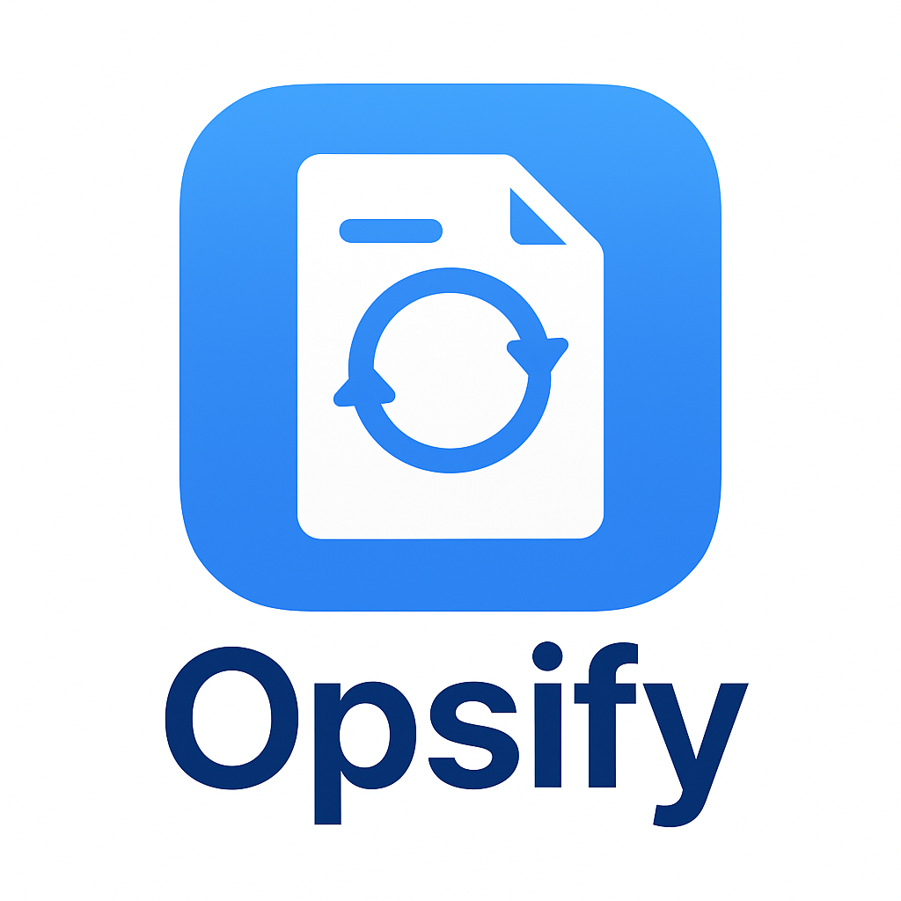

# Opsify

    

JavaFX desktop application for batch audio conversion using JavaCV (bundled FFmpeg). Includes progress reporting and logging.

Features
- Convert a single file or whole directories recursively
- Preserve original filenames and directory structure
- Choose target format (mp3, wav, ogg, m4a, flac, aac)
- Progress bar and log area in UI
- JavaCV embedded FFmpeg, no external binary required

Tech stack
- Java 21
- JavaFX 21 (controls, FXML)
- JavaCV 1.5.9
- SLF4J + Logback for logging
- JUnit 5 + AssertJ + Mockito for tests
- Maven

Build
- mvn -q -DskipTests package

Run
- mvn javafx:run

Test
- mvn -q test

Notes
- Ensure your system can initialize a JavaFX platform during tests; the tests bootstrap Platform.startup as needed.
- JaCoCo coverage rules are configured for util/service packages.

jpackage --type exe --input target --main-jar opsify-1.0.0.jar --main-class com.opsify.app.Main --name Opsify --app-version 1.0 --win-dir-chooser --win-menu --win-shortcut --icon src/main/resources/logo/opsify.ico

jpackage --type dmg --input target --main-jar opsify-1.0.0.jar --main-class class com.opsify.app.Main --name Opsify --app-version 1.0 --icon src/main/resources/logo/opsify.ico